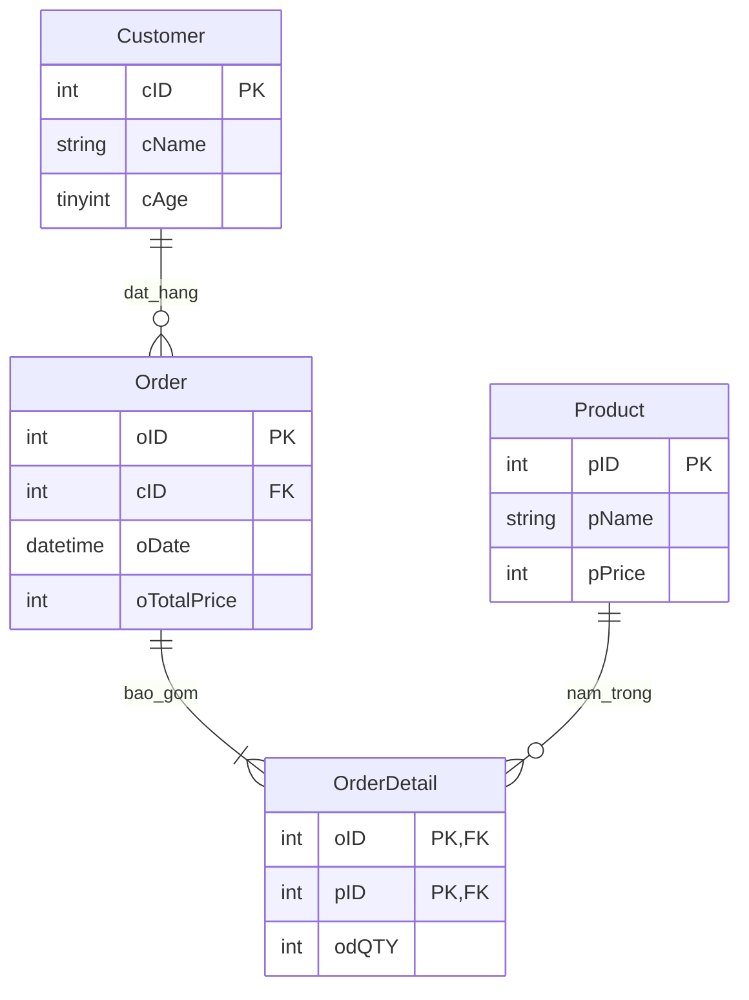

# [Bài tập] Xây dựng cơ sở dữ liệu Quản lý bán hàng

## 1. Mô tả dự án
Khởi tạo cơ sở dữ liệu `QuanLyBanHang` bao gồm 4 bảng (`Customer`, `Order`, `Product`, `OrderDetail`) đáp ứng đầy đủ các ràng buộc toàn vẹn dữ liệu.

## 2. Sơ đồ ERD (Mermaid)

## 3. Cấu trúc bảng & Ràng buộc
- **Customer**: `cID` (PK, Auto Inc), `cName` (NOT NULL), `cAge` (CHECK > 0).
- **Order**: `oID` (PK, Auto Inc), `cID` (FK references Customer), `oDate` (NOT NULL), `oTotalPrice`.
- **Product**: `pID` (PK, Auto Inc), `pName` (NOT NULL), `pPrice` (CHECK >= 0).
- **OrderDetail**: Khóa chính hợp phần `(oID, pID)`, Khóa ngoại `oID` & `pID`, `odQTY` (CHECK > 0).
