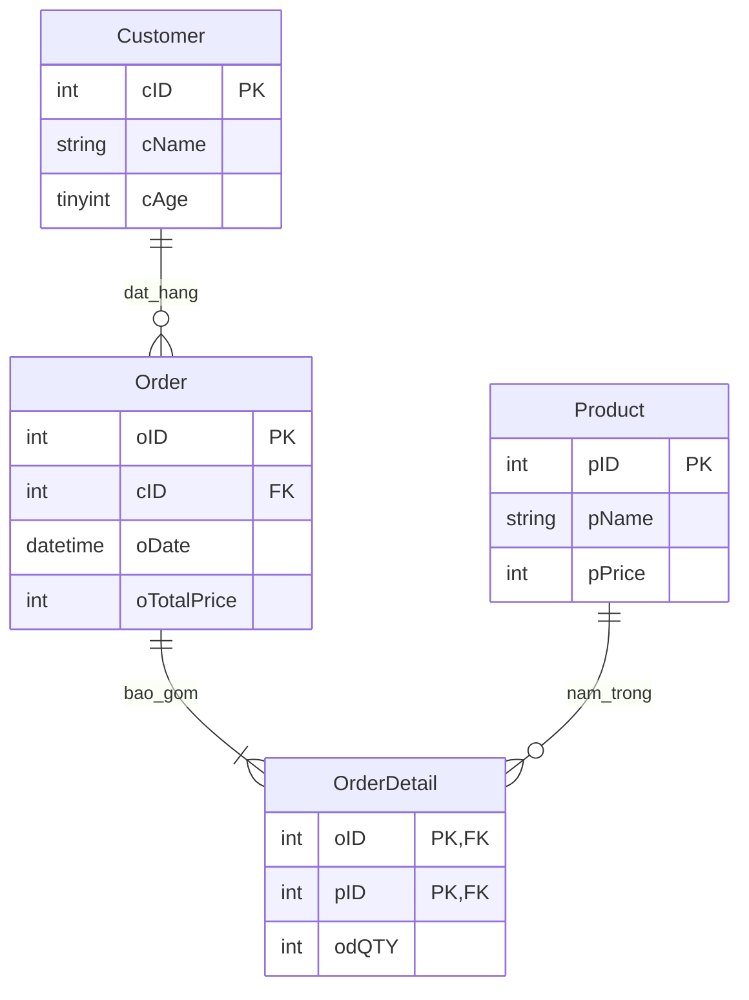

# [Bài tập] Xây dựng cơ sở dữ liệu Quản lý bán hàng

## 1. Mô tả dự án
Dự án khởi tạo cơ sở dữ liệu `QuanLyBanHang` gồm 4 bảng chính (`Customer`, `Order`, `Product`, `OrderDetail`) nhằm phục vụ việc quản lý khách hàng, hóa đơn và chi tiết mua hàng.

## 2. Sơ đồ ERD (Mermaid)

## 3. Cấu trúc bảng & Các ràng buộc
- **Customer**: `cID` (PK, Auto Inc), `cName` (NOT NULL), `cAge` (CHECK > 0).
- **Order**: `oID` (PK, Auto Inc), `cID` (FK references Customer), `oDate` (NOT NULL), `oTotalPrice`.
- **Product**: `pID` (PK, Auto Inc), `pName` (NOT NULL), `pPrice` (CHECK >= 0).
- **OrderDetail**: Khóa chính hợp phần `(oID, pID)` đóng vai trò là FK tham chiếu tới `Order` và `Product`, `odQTY` (CHECK > 0).
